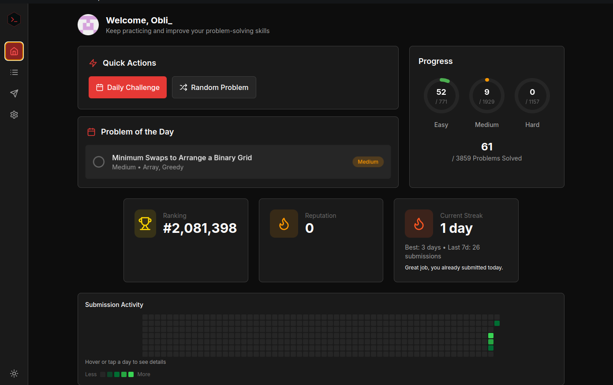
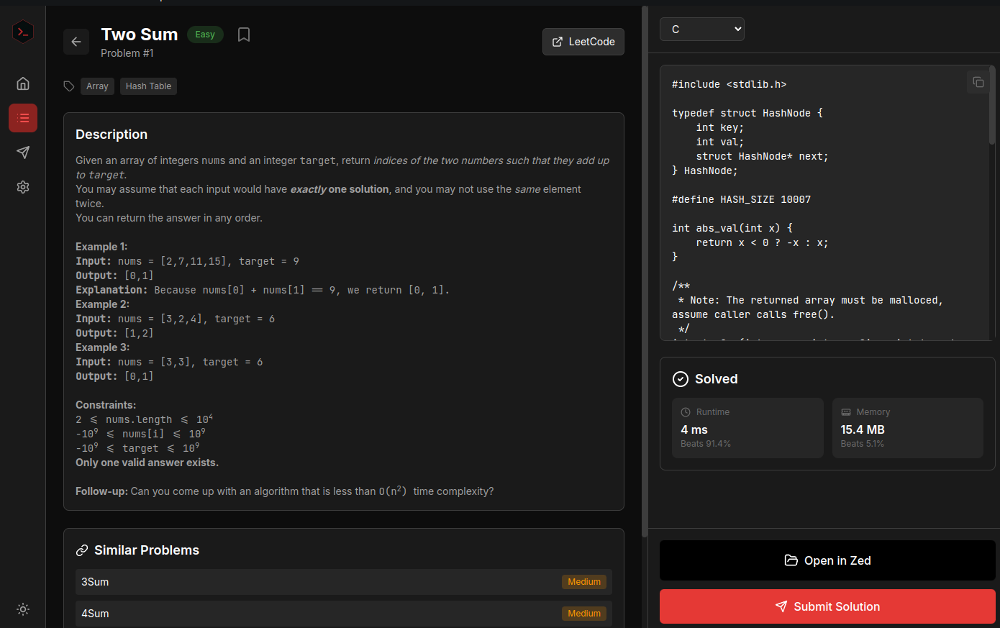

# LeetGrind

<p align="center">
  
</p>

### Home Dashboard


> I'll get my numbers up now... I hope </3


## Features

- **Home Dashboard** - Quick stats, progress rings, heat map, daily challenge
- **Problem List** - Search, filter by difficulty/status, pagination
- **Problem Detail** - Description, code template, submit code
- **Submissions** - View all submissions with runtime & memory percentiles
- **Dark/Light Theme** - System preference support
- **Persistent Cache** - Problems cached locally, background refresh on restart

## Installation

Download the latest release for your platform from the [Releases](https://github.com/Obli04/LeetGrind/releases) page:

### Quick Start

1. Download and install the app for your platform
2. Launch the app
3. Enter your LeetCode session cookie (see [How to get your cookie](#how-to-get-your-leetcode-cookie))


## Building

```bash
git clone https://github.com/Obli04/LeetGrind.git
cd LeetGrind
npm install
```

```bash
npm run dev
```

```bash
npm run build
```

## How to Get Your LeetCode Cookie

1. Open [LeetCode](https://leetcode.com) in your browser
2. Log in to your account
3. Open Developer Tools (F12 or right-click → Inspect)
4. Go to the **Application** tab (Chrome) or **Storage** tab (Firefox)
5. Expand **Cookies** → **https://leetcode.com**
6. Copy the value of the `LEETCODE_SESSION` cookie
7. Paste it into the LeetGrind login screen

## To Do

1. Implement a feature to save old results - See what problems you have already solved.
2. Improve the UI/UX for better user experience
3. Better Documentation
4. Overhaul Home Page
  
## Contributing

We welcome contributions! Here's how you can help:

### Ways to Contribute

- **Bug Reports** - Open an issue with details
- **Feature Requests** - Suggest new features
- **Code Contributions** - Submit pull requests
- **Documentation** - Improve docs

### Pull Request Process

1. Fork the repository
2. Create a feature branch (`git checkout -b feature/amazing-feature`)
3. Make your changes
4. Run tests/build (`npm run build`)
5. Commit your changes (`git commit -m 'Add amazing feature'`)
6. Push to the branch (`git push origin feature/amazing-feature`)
7. Open a Pull Request

## License

This project is licensed under the MIT License - see the [LICENSE](LICENSE) file for details.

## Acknowledgments

- A special thank you to @JacobLinCool and the contributors for [leetcode-query](https://github.com/JacobLinCool/LeetCode-Query).
